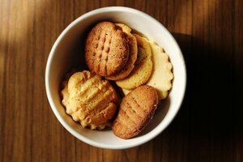

<h1>Butter biscuits</h1>

This really simple biscuit recipe will teach you how to make basic shortcrust pastry. It takes a bit more time but the results are delicious. These cookies are served without any additions, but it’s possible to add cocoa to the dough or top it with some marmalade. You can read about these additions in the recipe modifications sections. 

**A list of ingredients**

- 250 g all-purpose flour + some extra flour for the bakeboard (50 g)
- 90 g powdered sugar
- 1 egg yolk fridge cold
- 190 g fridge cold butter

**Possible additions:** cocoa, marmalade

**Tools:** two small bowls, table and tea spoons, one large bowl, a bakeboard, a rolling pin, cling film, biscuit cutters or a glass, sieve, baking paper.

- This recipe makes around 3 trays of biscuits.
- Preparation and baking time: 1,5 h
- Baking time: 10-20 minutes
- Level: easy

**Instructions**

1.	Place the bakeboard on the kitchen counter. If you don’t have a bakeboard, just use  the kitchen counter, but make sure to clean the surface beforehand.
2.	Sift the flour on the bakeboard.
3.	Sift the powdered sugar on the flour.
4.	Take the butter out of the fridge and place it in the middle of your flour and sugar pile. 
5.	Use a sharp knife to cut butter into small pieces.
6.	Prepare two small bowls to separate your egg white from the yolk.
7.	Take the egg from the fridge. It must be cold.
8.	Wash your egg in the cold water, crack the egg over a small bowl, take a table spoon to catch the yolk and drop it into the second small bowl. You can also grab the yolk in your palm if it doesn’t want to get into the spoon.
9.	Do not throw away the egg white, you can use it for an omelette or scrambled eggs.
10.	Add your egg yolk to the dough on the bakeboard.
11.	Mold the dough with your hands until it forms a solid and greasy in touch ball. The dough should not be falling apart. You should get a nice yellowish colour at the end of this process.
12.	When the dough is formed, wrap it in cling film, put in a large bowl and place in the fridge for 1 hour.
13.	Sprinkle a bit of flower on the bakeboard and spread it evenly so the dough doesn’t stick to the board. You can also use cling film instead of flour or wrap the rolling pin in it.
14.	After 1 hour take out the dough from the fridge and put it back on the bakeboard.
15.	Preheat the oven to 180 C/365 F. It will take just enough time to heat up, meanwhile you will be forming the biscuits from the dough.
16.	Take out the oven tray and put the baking paper on it.
17.	Cut a piece of dough from the ball. It can be from around 2 cm to 2,5 cm thick. Use a rolling pin and roll the piece of the dough flat on the bakeboard. The flat shortcrust should be 5 mm thin. 
18.	Cut out round shapes with a glass or biscuit cutters and put them on the baking tray.
19.	 If there are bits of the dough left, just stick them back into the main dough mass and repeat the rolling out process.
20.	When the tray is filled with the biscuits, put it into the pre-heated oven. 
21.	Bake for 10-20 minutes. Top and bottom heat function.
22.	Depending on your oven it’s good to check the biscuits after the first 10 minutes and see if they have changed their colour. They should be slightly brown. It’s easy to burn them, so keep checking.
23.	When the biscuits are ready, take them out of the oven and let them cool down for the next 15 minutes.
24.	Place the biscuits on the plate and enjoy the taste of your hard work.

**Possible modifications**

**Cocoa** 
If you don’t like plain butter biscuits, you can use cocoa for a chocolate flavour. You can add 60 g of cocoa to the dough of this recipe.

**Marmalade**

Another possibility is to use marmalade. When you are cutting out biscuits from the dough, you can make an indentation in the middle of the biscuit and put a little marmalade inside. DO NOT USE JAM because it’s not dense enough and the fruit juices will evaporate in high temperature. 

**Decorations**

If you have the soul of an artist, you may want to make some extra decorations on the plain butter biscuits. You can use a wooden toothpick or a blunt knife and try out some patterns on the dough before baking to make them more interesting. 
