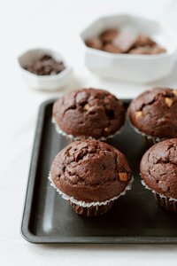

<h1>Chocolate Muffins Recipe</h1>

There are many variations of the muffins – they can go well with fruits, cream cheese or any other sweet additions. This recipe focuses on chocolate muffins.

- This recipe serves: 12 muffins.
- Preparation time: 10 minutes
- Baking time: 20-25 minutes
- Level: easy

**A list of ingredients**

- 3 large eggs
- 100 g melted butter
- 150 g natural yoghurt
- 200 g flour
- 120 g icing sugar
- 50 g unsweetened natural cocoa powder
- 1,5 teaspoon of soda or baking powder
- a pinch of salt
- 70 g chocolate (dark, white or milk)

**Tools:** a mixer, a saucepan, a muffin pan, a sieve, two tall bowls, tea and table spoons, a toothpick or a paring knife.

**Instructions**

1. Preheat the oven to 180 C/365 F. It will take just enough time to heat, meanwhile you will prepare the muffin batter.
2. Take one large bowl.
3. Sift flour, icing sugar, cocoa and soda (or baking powder).
4. Add a pinch of salt.
5. Use the table spoon to mix all dry ingredients.
6. Put the bowl aside.
7. Take the saucepan (or a small pot) and put in the butter.
8. Melt the butter in the saucepan stirring all the time with a spoon so it doesn’t burn.
9. When the butter is melted put it aside to cool down.
10. Take the second large bowl.
11. Crack in eggs, add in yoghurt and pour in cooled down melted butter.
12. Use the mixer (or blender) to combine all ingredients.
13. Take the first bowl with dry ingredients and add them gradually to mix in with the wet ingredients.
14. You should get a slightly moist dough when all ingredients are well mixed. If the dough is too wet, you can add a bit of flour. If it’s too dry you can add a bit of water or milk – 2 or 3 table spoons.
15. Leave the dough to rest for a moment.
16. Take the chocolate bar of your choice and break it into pieces.
17. Take out the muffin pan. If you opted for a metal muffin pan without the silicon cups, you should grease the pan with oil or butter so the muffins don't stick to the pan while baking.
18. Take a table spoon and only fill HALF of each muffin cup.
19. Place one piece of chocolate in it and cover it with the dough to fill the entire cup.
20. Repeat for every cup.
21. When you fill in the entire muffin pan, put it in the pre-heated (180 C) oven.
22. Bake for around 20-25 minutes. Top and bottom heat function.
23. Insert a toothpick or a paring knife into the centre of the cake to see if the crumb has set. The toothpick or knife should come out dry if the muffins are ready.
24. Take out the muffins out from the oven and leave them for around 15 minutes in the pan to cool down.
25. When they cool down, take them out of the pan onto a plate. They are ready to eat.

**Possible modifications**

This recipe can be easily modified. 

You can substitute cocoa powder and chocolate with fruits – blueberries or strawberries work best for muffins, but feel free to use any other favourite fruit of your choice.

If you stick to chocolate you can also try combining two or three types of chocolate e.g. white pieces inside the muffin and dark chocolate chips on top or the other way round.

Any changes you make will only slightly affect the texture and the flavour of the dough. I invite you to experiment and find your favourite version. 
