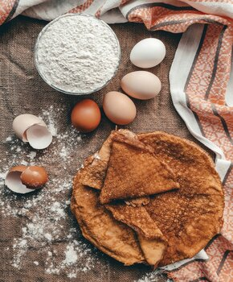

<h1>Standard Baking Ingredients</h1>

Below you'll find a list of products which are used for baking any type of cake or pastry:

    • Flour
    • Potato starch
    • Eggs 
    • Milk, yoghurt, cream, buttercream
    • Butter, lard, olive oil, coconut oil, vegetable shortening
    • Baking soda, baking powder
    • Yeast 
    • Sugar
    • Salt 

You would normally have most of them at home, so it only proves how little you need to bake a simple sweet treat.

