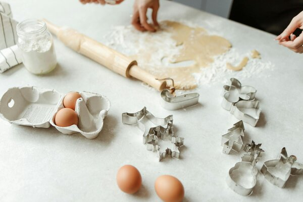

<h1>Tools</h1>

This section discusses various tools you'll need to bake something. They'll make your baking faster and save you a lot of muscle work. However, you don’t need all of them and if something isn’t essential, you'll be given an alternative solution. 

A list of the baking tools:

-	a mixer or blender
-	a bakeboard
-	a muffin pan or baking forms/tins
-	a saucepan
-	tall bowls
-	kitchen scale
-	tea and table spoons
-	a wooden/silicone spatula
-	a sieve
-	baking paper
-	cling film
-	a rolling pin
-	a toothpick or a paring knife

You can read more about each tool in the separate sections of this guide.

