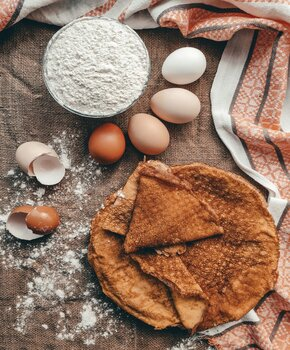

<h1>Standard Baking Ingredients</h1>

Below you will find a list of products which are used for baking any type of cake or pastry:

-	flour
-	potato starch
-	eggs 
-	milk, yoghurt, cream, buttercream
-	butter, lard, olive oil, coconut oil, vegetable shortening
-	baking soda, baking powder
-	yeast 
-	sugar
-	salt 

You would normally have most of them at home, so it only proves how little you need to bake a simple sweet treat.

